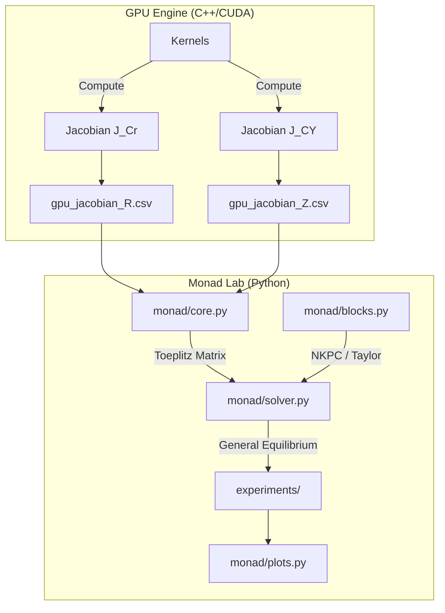

# Monad Engine v4.0: NK-HANK Base

**The "Monad Lab" Release**

> *December 2025 - Full Heterogeneous Agent New Keynesian (HANK) Model with GPU Acceleration and Python Research Platform*

[](https://isocpp.org/std/the-standard)
[](https://developer.nvidia.com/cuda-toolkit)
[](https://www.python.org/)
[]()

## Overview

**Monad Engine** is a high-performance computational framework for solving Two-Asset HANK models. 
Version 4.0 integrates a **GPU-accelerated micro-foundation** with a **modular Python laboratory**, enabling complex macroeconomic experiments (like Forward Guidance and Fiscal Multipliers) in milliseconds.

### Key Features v4.0

1.  **GPU Income Jacobian ($J_{C,Y}$)**:
    *   Computes the sensitivity of consumption to income shocks directly on the GPU.
    *   Captures the "Indirect Effect" (Keynesian Multiplier) crucial for HANK dynamics.
    *   Jacobian computation time: **< 100ms** (RTX 4090).

2.  **Monad Lab (`monad/`)**:
    *   New modular Python package for policy research.
    *   Clean separation of Data (`core.py`), Theory (`blocks.py`), and Solution (`solver.py`).
    *   Plug-and-play New Keynesian blocks (NKPC, Taylor Rule, Fisher Equation).

3.  **Advanced Experiments**:
    *   **Consumption Decomposition**: Visualizing Direct (Substitution) vs Indirect (Income) channels.
    *   **Forward Guidance**: Verified "Anticipation Effects" of future policy announcements.

---

## Architecture




---

## Quick Start

### 1. Build the Engine (C++)
The C++ core must be built to generate the Jacobian matrices.

```bash
mkdir build_phase3
cd build_phase3
cmake .. -G "Visual Studio 17 2022" -A x64
cmake --build . --config Release
```

### 2. Generate Data (Run Engine)
Execute the solver to produce the micro-Jacobians (`gpu_jacobian_R.csv`, `gpu_jacobian_Z.csv`).

```powershell
.\Release\MonadTwoAssetCUDA.exe
```

### 3. Run Experiments (Python)
Now use the **Monad Lab** to solve for General Equilibrium and analyze results.

```bash
# Experiment 1: Monetary Policy Shock (+25bps)
python experiments/02_monetary_shock.py

# Experiment 2: Forward Guidance (Rate Cut Promise)
python experiments/03_forward_guidance.py
```

---

## Directory Structure

```text
Monad/
├── src/                  # C++/CUDA GPU Core
│   ├── gpu/              # Custom CUDA Kernels (Dual EGM)
│   ├── solver/           # TwoAssetSolver logic
│   └── main_two_asset.cpp
├── monad/                # Python Research Package
│   ├── core.py           # Backend Data Loader
│   ├── blocks.py         # New Keynesian Equations
│   ├── solver.py         # GE Solver (DAG Assembly)
│   └── plots.py          # Visualization Tools
├── experiments/          # Research Scripts
│   ├── 02_monetary_shock.py
│   └── 03_forward_guidance.py
├── docs/                 # Documentation
└── gpu_jacobian_*.csv    # Interface Data
```

---

## Results

### Consumption Decomposition
The "Money Plot" showing how the **Indirect Income Effect** (Red) amplifies the **Direct Substitution Effect** (Blue).


### Forward Guidance
Validating the **Anticipation Effect**: Consumption rises at $t=0$ in response to a rate cut announced for $t=4$.


---

## License

MIT License

---

**Monad Engine Development Team**
*v4.0 Final Release - December 2025*
