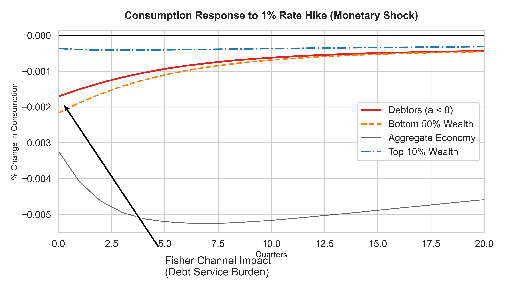
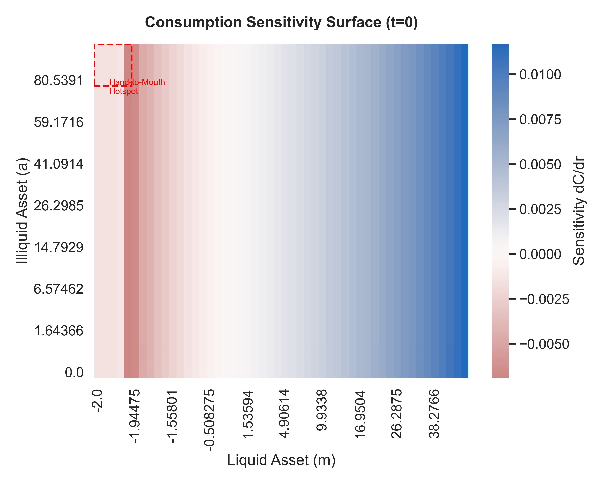

# Monad Engine v3.3

**Fastest Open-Source GPU-Accelerated Two-Asset HANK Solver with Full GE**

> *December 2025 - Complete Sequence Space Jacobian (SSJ) implementation with CUDA acceleration and Python-based General Equilibrium solver*

[](https://isocpp.org/std/the-standard)
[](https://developer.nvidia.com/cuda-toolkit)
[](https://eigen.tuxfamily.org/)
[](https://www.python.org/)
[](https://opensource.org/licenses/MIT)


## 概要

Monad Engineは、**Two-Asset HANKモデル**（流動性資産と非流動性資産を持つ異質性エージェントモデル）を高速に解くための計算エンジンです。

### 主な機能

- **定常状態ソルバー**: Endogenous Grid Method (EGM) による高速な政策関数計算
- **分布ダイナミクス**: スパース行列による効率的な分布収束計算
- **一般均衡ソルバー**: Sequence Space Jacobian (SSJ) 法による動的一般均衡
- **不平等分析**: 金融政策ショックの分配的影響の定量化

---

## アーキテクチャ

```
┌─────────────────────────────────────────────────────────────────┐
│                      Monad Engine v3.3                          │
├─────────────────────────────────────────────────────────────────┤
│  ┌─────────────┐  ┌─────────────┐  ┌─────────────────────────┐  │
│  │  Grid       │  │  Policy     │  │  Distribution           │  │
│  │  Generator  │→ │  Solver     │→ │  Aggregator             │  │
│  │  (m, a, z)  │  │  (EGM/VFI)  │  │  (Sparse Transition)    │  │
│  └─────────────┘  └─────────────┘  └─────────────────────────┘  │
│         │                │                      │               │
│         ▼                ▼                      ▼               │
│  ┌─────────────────────────────────────────────────────────────┐│
│  │                 SSJ Framework (Phase 2-3)                   ││
│  │  ┌──────────────┐  ┌────────────────┐  ┌─────────────────┐ ││
│  │  │ Jacobian     │  │ Fake News      │  │ General         │ ││
│  │  │ Builder (AD) │→ │ Aggregator     │→ │ Equilibrium     │ ││
│  │  │ (Dual EGM)   │  │ (∂D/∂θ)        │  │ (I - J_CY)^-1   │ ││
│  │  └──────────────┘  └────────────────┘  └─────────────────┘ ││
│  └─────────────────────────────────────────────────────────────┘│
│         │                                                       │
│         ▼                                                       │
│  ┌─────────────────────────────────────────────────────────────┐│
│  │              Analysis Suite (Phase 3)                       ││
│  │  ┌────────────────┐  ┌─────────────────────────────────────┐││
│  │  │ Inequality     │  │ Python Visualization               │││
│  │  │ Analyzer       │→ │ (Winners/Losers, Heatmaps)         │││
│  │  └────────────────┘  └─────────────────────────────────────┘││
│  └─────────────────────────────────────────────────────────────┘│
└─────────────────────────────────────────────────────────────────┘
```

---

## 🚀 v3.3 新機能: GPU SSJ + Linearized GE

### GPU加速 Sequence Space Jacobian

CUDAカーネルによる完全GPU実行フロー:

1. **Dual Number EGM**: 政策関数の自動微分 (`dC/dr_m`, `dB/dr_m`)
2. **FakeNews Kernel**: 分布摂動の高速計算
3. **IRF計算**: GPUでの集計・Toeplitz Jacobian構築

### Jacobian出力サンプル (`gpu_jacobian.csv`)

```csv
t,dC,dB
0,0.922237,9.44314
1,0.818666,8.41489
2,0.747127,7.4755
...
```

- **dB/dr_m > 0**: 金利上昇 → 貯蓄増加（正常な反応）
- **Mean-reverting**: 9.44 → 1.49（定常状態へ収束）

### Python GEソルバー

```python
from monad.ge_solver import LinearizedGESolver
import numpy as np

solver = LinearizedGESolver("gpu_jacobian.csv", T=50)
shock = np.ones(50) * 0.01  # 1% 永続的債務ショック
dr_m, dC = solver.solve_full_ge(shock)

print(f"Rate: +{dr_m[0]*10000:.1f}bps, Consumption: +{dC[0]*100:.2f}%")
```

### GE均衡応答


*1% 永続的国債増発ショックに対する一般均衡応答。左：金利パス（+10.6bps）、右：消費応答。*

---

## クイックスタート

### 必要環境

- **C++17** 対応コンパイラ (g++ 9+, MSVC 2019+, clang 10+)
- **Eigen 3.4+** (自動ダウンロード可能)
- **Python 3.8+** (可視化用)
  - pandas, matplotlib, seaborn, numpy

### ビルド

```bash
# CMakeでビルド
mkdir build && cd build
cmake ..
cmake --build . --config Release

# または直接g++で
g++ -std=c++17 src/main_two_asset.cpp -I . -I /path/to/eigen -o MonadTwoAsset.exe
```

### 実行

```bash
# Two-Asset HANKモデルの実行
./MonadTwoAsset.exe

# 出力ファイル:
# - policy_2asset.csv    : 政策関数
# - dist_2asset.csv      : 定常分布
# - ge_irf.csv           : 一般均衡インパルス応答
# - irf_groups.csv       : グループ別消費応答
# - heatmap_sensitivity.csv : 感応度ヒートマップ
```

### 可視化

```bash
python monad/vis_inequality.py
# 出力: inequality_winners_losers.png, inequality_heatmap.png
```

---

## プロジェクト構造

```
Monad/
├── src/                          # C++コアエンジン
│   ├── main_two_asset.cpp        # メインエントリポイント
│   ├── Dual.hpp                  # 自動微分 (Forward Mode AD)
│   ├── Params.hpp                # パラメータ定義
│   ├── UnifiedGrid.hpp           # グリッド基盤
│   ├── grid/
│   │   └── MultiDimGrid.hpp      # 3次元状態空間 (m, a, z)
│   ├── kernel/
│   │   └── TwoAssetKernel.hpp    # EGMカーネル
│   ├── solver/
│   │   └── TwoAssetSolver.hpp    # 政策関数ソルバー
│   ├── aggregator/
│   │   └── DistributionAggregator3D.hpp  # 分布集計
│   ├── ssj/                      # Sequence Space Jacobian
│   │   ├── SparseMatrixBuilder.hpp
│   │   ├── JacobianBuilder3D.hpp # Dual EGM
│   │   ├── FakeNewsAggregator.hpp
│   │   ├── SsjSolver3D.hpp
│   │   └── GeneralEquilibrium.hpp
│   └── analysis/
│       └── InequalityAnalyzer.hpp
├── monad/                        # Python可視化・分析
│   └── vis_inequality.py
├── middleware/                   # Python-C++連携
│   └── converter.py
├── CMakeLists.txt
└── README.md
```

---

## 主要コンポーネント

### 1. Two-Asset EGM Solver

流動性資産 $m$ と非流動性資産 $a$ を持つ家計の最適化問題を解きます。

**Bellman方程式:**
$$V(m, a, z) = \max_{c, m', a'} u(c) + \beta \mathbb{E}[V(m', a', z')]$$

**制約:**
- 予算制約: $c + m' + d + \chi(d, a) = (1+r_m)m + (1+r_a)a + wz$
- 借入制約: $m' \geq \underline{m}$

### 2. Sequence Space Jacobian (SSJ)

Auclert et al. (2021) の手法に基づく一般均衡計算:

1. **Jacobian Builder**: Dual数による政策関数微分 $\partial c / \partial r$
2. **Fake News Aggregator**: 分布摂動 $\partial D / \partial \theta$
3. **GE Solver**: $(I - J_{CY})^{-1} J_{Cr} \cdot dr$

### 3. Inequality Analyzer

金融政策の分配的影響を分析:
- **グループ別消費応答**: Top 10% vs Bottom 50% vs Debtors
- **Fisher Channel**: 債務者への利子負担増加効果
- **感応度ヒートマップ**: $(m, a)$ 空間での反応分布

---

## 理論的背景

本エンジンは以下の先行研究に基づいています:

- **Kaplan, Moll, Violante (2018)**: "Monetary Policy According to HANK"
- **Auclert et al. (2021)**: "Using the Sequence-Space Jacobian to Solve and Estimate Heterogeneous-Agent Models"
- **Bayer et al. (2019)**: "Precautionary Savings, Illiquid Assets, and the Aggregate Consequences of Shocks to Household Income Risk"

---

## 出力例

### Winners & Losers Panel


### Sensitivity Heatmap


---

## ライセンス

MIT License

---

## 著者

Monad Engine Development Team

---

## 謝辞

- Eigenライブラリ開発チーム
- SSJ手法の開発者 (Auclert, Bardóczy, Rognlie, Straub)
